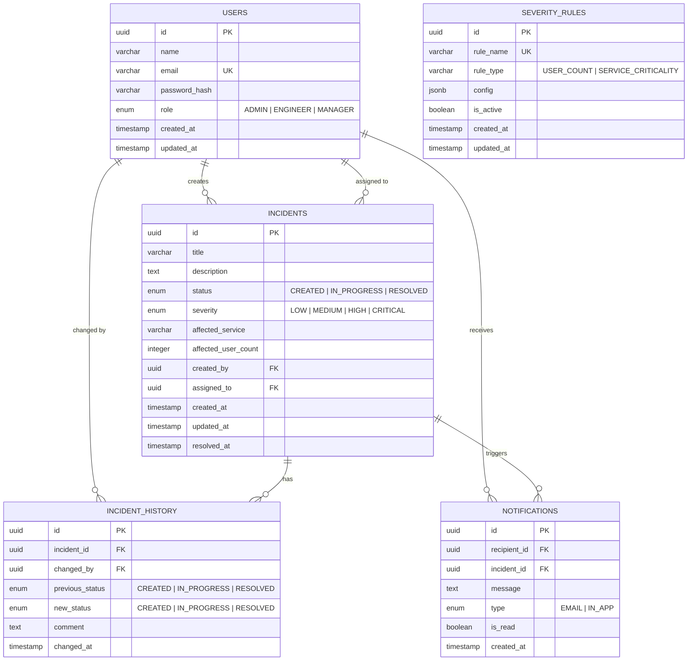

# ER Diagram — SIRS

## Overview
This Entity-Relationship diagram shows the database schema for the SIRS platform. All tables, columns, types, and relationships are defined below.

---

---

## Table Summary
| Table | Description | Key Relationships |
|-------|-------------|-------------------|
| `USERS` | All platform users (admins, engineers, managers) | → Incidents, Notifications, History |
| `INCIDENTS` | Reported production incidents with severity and status | ← User (created_by, assigned_to) → History, Notifications |
| `INCIDENT_HISTORY` | Audit log of every status change for an incident | ← Incident, User (changed_by) |
| `NOTIFICATIONS` | Notifications sent to users on incident events | ← User (recipient), Incident |
| `SEVERITY_RULES` | Configurable rules and thresholds for severity calculation | Standalone config table |

---

## Key Indexes
| Table | Index | Purpose |
|-------|-------|---------|
| `INCIDENTS` | `(status)` | Fast filtering by incident status |
| `INCIDENTS` | `(severity)` | Filter incidents by severity for reports |
| `INCIDENTS` | `(created_by)` | Find all incidents reported by a user |
| `INCIDENTS` | `(assigned_to)` | Find incidents assigned to an engineer |
| `INCIDENT_HISTORY` | `(incident_id, changed_at)` | Timeline queries for a specific incident |
| `NOTIFICATIONS` | `(recipient_id, is_read)` | Unread notification count and listing |
| `USERS` | `(email)` | Login lookup (already has UNIQUE constraint) |
