```mermaid
classDiagram
    direction TB

    %% ===== DOMAIN MODELS =====

    class User {
        -id: string
        -name: string
        -email: string
        -passwordHash: string
        -role: UserRole
        -createdAt: Date
        -updatedAt: Date
        +getName(): string
        +getEmail(): string
        +getRole(): UserRole
        +hasPermission(action: string): boolean
    }

    class UserRole {
        <<enumeration>>
        ADMIN
        ENGINEER
        MANAGER
    }

    class Incident {
        -id: string
        -title: string
        -description: string
        -status: IncidentStatus
        -severity: Severity
        -affectedService: string
        -affectedUserCount: number
        -createdBy: string
        -assignedTo: string
        -createdAt: Date
        -updatedAt: Date
        -resolvedAt: Date
        +transitionTo(newStatus: IncidentStatus): void
        +isResolved(): boolean
        +assignTo(userId: string): void
        +getSeverity(): Severity
    }

    class IncidentStatus {
        <<enumeration>>
        CREATED
        IN_PROGRESS
        RESOLVED
    }

    class Severity {
        <<enumeration>>
        LOW
        MEDIUM
        HIGH
        CRITICAL
    }

    class IncidentHistory {
        -id: string
        -incidentId: string
        -changedBy: string
        -previousStatus: IncidentStatus
        -newStatus: IncidentStatus
        -comment: string
        -changedAt: Date
    }

    class Notification {
        -id: string
        -recipientId: string
        -incidentId: string
        -message: string
        -type: NotificationType
        -isRead: boolean
        -createdAt: Date
        +markAsRead(): void
    }

    class NotificationType {
        <<enumeration>>
        EMAIL
        IN_APP
    }

    class SeverityRule {
        -id: string
        -ruleName: string
        -ruleType: string
        -config: JSON
        -isActive: boolean
        -createdAt: Date
        +isEnabled(): boolean
    }

    %% ===== SERVICE LAYER =====

    class IncidentController {
        -incidentService: IncidentService
        +createIncident(dto: CreateIncidentDto): Incident
        +updateStatus(id: string, dto: UpdateStatusDto): Incident
        +getIncidentById(id: string): Incident
        +getAllIncidents(filters: FilterDto): Incident[]
        +getIncidentHistory(id: string): IncidentHistory[]
    }

    class IncidentService {
        -incidentRepo: IIncidentRepository
        -severityCalculator: SeverityCalculator
        -notificationService: NotificationService
        +createIncident(data: CreateIncidentDto): Incident
        +updateIncidentStatus(id: string, status: IncidentStatus, userId: string): Incident
        +getIncidentById(id: string): Incident
        +getAllIncidents(filters: object): Incident[]
    }

    class SeverityCalculator {
        -strategies: ISeverityStrategy[]
        +calculateSeverity(incidentData: object): Severity
        +addStrategy(strategy: ISeverityStrategy): void
    }

    class ISeverityStrategy {
        <<interface>>
        +evaluate(incidentData: object): Severity
    }

    class UserCountStrategy {
        +evaluate(incidentData: object): Severity
    }

    class ServiceCriticalityStrategy {
        -criticalServices: string[]
        +evaluate(incidentData: object): Severity
    }

    class NotificationService {
        -observers: INotificationObserver[]
        -userRepo: IUserRepository
        -channels: INotificationChannel[]
        +subscribe(observer: INotificationObserver): void
        +notifyOnCreation(incident: Incident): void
        +notifyOnStatusChange(incident: Incident, oldStatus: IncidentStatus): void
        +notifyOnEscalation(incident: Incident): void
    }

    class INotificationObserver {
        <<interface>>
        +onEvent(event: IncidentEvent): void
    }

    class INotificationChannel {
        <<interface>>
        +send(recipient: User, message: string, type: string): void
    }

    class EmailNotificationChannel {
        +send(recipient: User, message: string, type: string): void
    }

    class InAppNotificationChannel {
        +send(recipient: User, message: string, type: string): void
    }

    %% ===== REPOSITORY INTERFACES =====

    class IIncidentRepository {
        <<interface>>
        +findById(id: string): Incident
        +findAll(filters: object): Incident[]
        +save(incident: Incident): Incident
        +update(incident: Incident): void
    }

    class IUserRepository {
        <<interface>>
        +findById(id: string): User
        +findByEmail(email: string): User
        +findByRole(role: UserRole): User[]
        +save(user: User): User
    }

    class IHistoryRepository {
        <<interface>>
        +findByIncidentId(id: string): IncidentHistory[]
        +save(history: IncidentHistory): IncidentHistory
    }

    %% ===== RELATIONSHIPS =====

    User --> UserRole
    User "1" --> "*" Incident : creates
    User "1" --> "*" Incident : assigned to
    User "1" --> "*" Notification : receives
    Incident --> IncidentStatus
    Incident --> Severity
    Incident "1" --> "*" IncidentHistory : has
    Incident "1" --> "*" Notification : triggers
    Notification --> NotificationType

    IncidentController --> IncidentService : uses
    IncidentService --> IIncidentRepository
    IncidentService --> SeverityCalculator
    IncidentService --> NotificationService

    SeverityCalculator --> ISeverityStrategy : has many
    ISeverityStrategy <|.. UserCountStrategy : implements
    ISeverityStrategy <|.. ServiceCriticalityStrategy : implements

    NotificationService --> INotificationObserver
    NotificationService --> INotificationChannel : has many
    NotificationService --> IUserRepository
    INotificationChannel <|.. EmailNotificationChannel : implements
    INotificationChannel <|.. InAppNotificationChannel : implements

    IncidentService --> IHistoryRepository
```

# Class Diagram — SIRS

## Overview
This class diagram shows the major classes, their attributes, methods, and relationships across the SIRS platform. The design follows **Clean Architecture** (Controller → Service → Repository) with strong **OOP principles** and **design patterns**.

---

---

## Design Patterns in the Class Diagram
| Pattern | Where Applied | Purpose |
|---------|---------------|---------|
| **Strategy** | `ISeverityStrategy`, `SeverityCalculator` | Swap severity calculation rules at runtime without changing service logic |
| **Observer** | `NotificationService` + `INotificationObserver` | Decouple incident events from notification dispatch |
| **State** | `IncidentStatus`, `Incident.transitionTo()` | Enforce valid lifecycle transitions (CREATED → IN_PROGRESS → RESOLVED) |
| **Repository** | `IIncidentRepository`, `IUserRepository`, `IHistoryRepository` | Abstract database operations from business logic |

## OOP Principles
| Principle | Application |
|-----------|-------------|
| **Encapsulation** | Private fields with public methods in all domain models (e.g., `Incident.transitionTo()` hides validation logic) |
| **Abstraction** | Interfaces for repositories, strategies, and notification channels hide implementation details |
| **Inheritance** | `UserCountStrategy` and `ServiceCriticalityStrategy` implement the `ISeverityStrategy` interface; channel implementations extend `INotificationChannel` |
| **Polymorphism** | `SeverityCalculator` calls `evaluate()` on any strategy without knowing which implementation it is; `NotificationService` sends via any channel |
