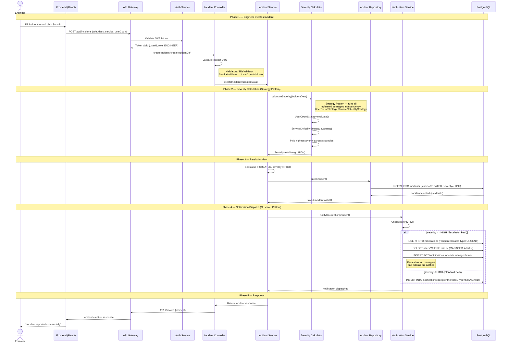

# Sequence Diagram — SIRS

## Main Flow: Incident Creation → Severity Calculation → Notification

This sequence diagram illustrates the complete lifecycle of an incident — from an engineer reporting a production issue, the system calculating severity using the strategy pattern, through to saving the incident and notifying relevant users.

---

---

## Flow Summary
| Phase | Description | Key Patterns Used |
|-------|-------------|-------------------|
| **1. Incident Creation** | Engineer submits incident details. Request validated through controller DTO validation. | DTO Pattern |
| **2. Severity Calculation** | Severity calculator runs all registered strategies and picks the highest result. | Strategy Pattern |
| **3. Persist Incident** | Incident saved to database with calculated severity and CREATED status. | Repository Pattern |
| **4. Notification Dispatch** | Notifications sent based on severity. HIGH/CRITICAL triggers escalation to managers and admins. | Observer Pattern |
| **5. Response** | Success response returned to engineer through the controller chain. | Clean Architecture |
