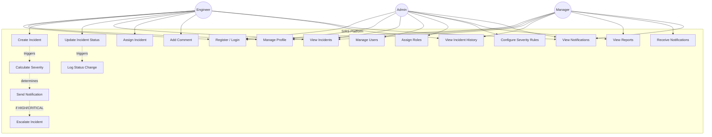

# Use Case Diagram — SIRS

## Overview
This diagram shows all major use cases for the SIRS platform, organized by the three primary actors: **Admin**, **Engineer**, and **Manager**, plus the internal **System** actor.

---

---

## Use Case Descriptions

| # | Use Case | Actors | Description |
|---|----------|--------|-------------|
| UC1 | Register / Login | All | Create account or authenticate with JWT. Role assigned at registration. |
| UC2 | Manage Profile | All | Update personal information and notification preferences. |
| UC3 | Create Incident | Engineer | Report a new production incident with title, description, affected service, and user impact. |
| UC4 | Update Incident Status | Engineer | Transition incident status: CREATED → IN_PROGRESS → RESOLVED. |
| UC5 | View Incidents | All | Browse incidents filtered by status, severity, service, or assignment. |
| UC6 | Assign Incident | Engineer | Assign an incident to a specific engineer for resolution. |
| UC7 | Add Comment | Engineer | Add notes or progress updates to an incident. |
| UC8 | View Incident History | Engineer, Manager | See the full timeline of status changes and comments for an incident. |
| UC9 | Manage Users | Admin | Create, update, or deactivate user accounts. |
| UC10 | Assign Roles | Admin | Assign Admin, Engineer, or Manager role to users. |
| UC11 | Configure Severity Rules | Admin | Set up or modify rules and thresholds used for severity calculation. |
| UC12 | View Reports | Admin, Manager | Access summary reports (incidents per service, resolution time, severity stats). |
| UC13 | Receive Notifications | Manager | Get notified automatically about HIGH/CRITICAL severity incidents. |
| UC14 | View Notifications | All | View in-app notification history and mark as read. |
| UC15 | Calculate Severity | System | Automatically calculate severity using registered strategies when incident is created. |
| UC16 | Send Notification | System | Send notifications to relevant users based on incident severity and roles. |
| UC17 | Log Status Change | System | Record every status transition in the incident history table. |
| UC18 | Escalate Incident | System | For HIGH/CRITICAL incidents, escalate by notifying all managers and admins. |
